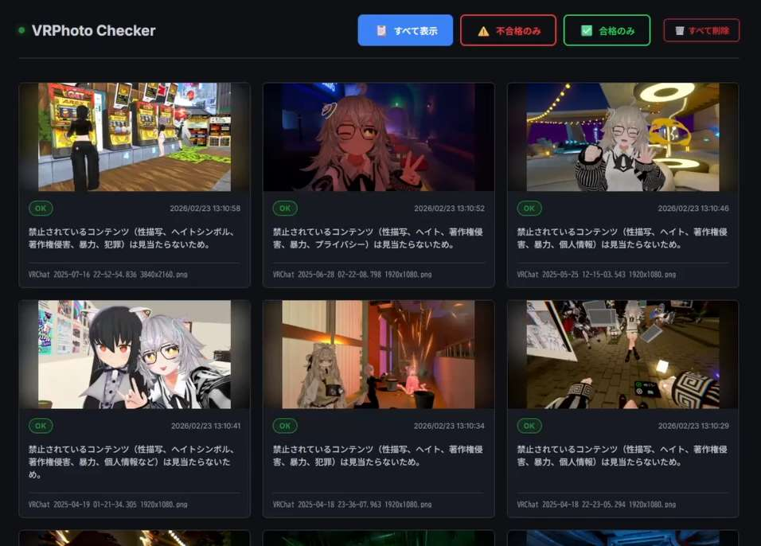

# VRPhoto Checker



**VR SNS で写真を撮るだけで、AI が自動でコンテンツ審査してくれるツールです。**

VRChat などの写真フォルダを設定して起動するだけ。あとは **バックグラウンドで常駐して全自動**。
ゲーム内でシャッターを切るたびに審査が走り、NG と判定されたら **即座に Windows 通知** でお知らせします。
ブラウザのダッシュボードでは、撮った画像の一覧と **「なぜ NG なのか」の理由** をいつでも確認できます。

審査はすべて自分の PC の中だけで完結。**画像がクラウドに送信されることは一切ありません。**

## ✨ こんなことができます

- 📸 **撮ったそばから自動チェック** — バックグラウンドで常駐し、VR SNS でシャッターを切るたびにリアルタイムで審査が走ります。一度起動したら放置で OK
- 🔔 **リアルタイム・アラート通知** — NG と判定された画像は即座に Windows 通知でお知らせ。VR プレイ中でも見逃さない
- 🌐 **理由つきダッシュボード** — ブラウザで審査済み画像を一覧表示。「なぜ NG か」の AI コメントをそれぞれ確認できる
- 🤖 **完全ローカル AI 審査** — [LM Studio](https://lmstudio.ai/) + ビジョン対応モデル（Gemma 4 など）で画像を分析。外部サーバー不使用
- ✏️ **ルールはカスタマイズ自由** — `rules.md` を編集するだけで審査基準を変更できます。再起動も不要
  - 性的コンテンツ（露出・性行為など）
  - 著作権侵害（無断キャラクター使用：ポケモン・Disney など）
  - ヘイトシンボル（禁止されたアイコン・記号）
  - 暴力・違法物品（血液描写、薬物など）
- 🔄 **自動リトライ** — コンテキスト不足で失敗した場合も、自動で画像を縮小して再送信

---

## 🖥️ 必要環境

| 項目 | 要件 |
|------|------|
| OS | Windows 10 / 11 |
| Python | 3.10 以上 |
| LM Studio | 最新版（ビジョン対応モデルのローカルサーバー起動が必要） |
| VRAM / RAM | シンボルチェック (CLIP): CPU で動作。LM Studio 側は 4B モデルで 4GB VRAM 以上推奨 |

---

## 🚀 セットアップ

```
[1] Python 3.10 以上をインストール
        │
        ▼
[2] このリポジトリをクローン / ZIP ダウンロード
        │
        ▼
[3] pip install -r requirements.txt
    （Pillow / open_clip_torch / torch の 3 つをインストール）
        │  ※ 初回は torch のダウンロードで数分かかる場合あり
        ▼
[4] LM Studio をインストール
        │
        ▼
[5] LM Studio で google/gemma-4-26b-a4b をダウンロード
        │
        ▼
[6] LM Studio の「Local Server」でモデルをロードしてサーバー起動
    （Context Length を 8192 以上に設定）
        │
        ▼
[7] config.json の watch_path を自分の VRChat フォルダに変更
        │
        ▼
[8] vrphoto-checker.py をダブルクリックで起動 → ブラウザが自動で開く
```

---

### 1. リポジトリのクローン

#### Git CLI を使う場合

1. **コマンドプロンプトを開く**
   - `Win + R` キーを押して「ファイル名を指定して実行」を開く
   - `cmd` と入力して Enter

2. **作業フォルダに移動する**（例: デスクトップ）
   ```
   cd %USERPROFILE%\Desktop
   ```
   任意のフォルダを指定してかまわない。`cd C:\Users\自分の名前\Documents` のように変更する。

3. **リポジトリをクローンする**
   ```
   git clone https://github.com/akiRAM2/vrphoto-checker.git
   cd vrphoto-checker
   ```

> **Git がインストールされていない場合は ZIP でダウンロードする**（下記参照）

#### Git CLI がない場合（ZIP ダウンロード）

1. [https://github.com/akiRAM2/vrphoto-checker](https://github.com/akiRAM2/vrphoto-checker) を開く
2. 緑色の「Code」ボタン → 「Download ZIP」をクリック
3. ダウンロードした ZIP を好きな場所に解凍する
4. コマンドプロンプトを開き、解凍したフォルダに移動する
   ```
   cd C:\解凍先のパス\vrphoto-checker-main
   ```

---

### 2. Python パッケージのインストール

このツールが使用する外部ライブラリは以下の 3 つ。それ以外はすべて Python 標準ライブラリ。

| ライブラリ | 用途 | バージョン目安 |
|-----------|------|--------------|
| `Pillow` | 画像の読み込み・リサイズ・JPEG 変換 | 10.0 以上 |
| `open_clip_torch` | シンボルチェック用の CLIP モデル読み込み | 2.24 以上 |
| `torch` | CLIP モデルの実行エンジン（PyTorch） | 2.0 以上 |

**インストール手順:**

```bash
pip install -r requirements.txt
```

---

### 3. LM Studio のインストールと設定

#### 3-1. LM Studio のインストール

[https://lmstudio.ai/](https://lmstudio.ai/) からインストーラーをダウンロードして実行する。

#### 3-2. ビジョン対応モデルのダウンロード

LM Studio の「Discover」タブで以下のモデルを検索してダウンロードする。

| モデル | 推奨量子化 | VRAM 目安 | 備考 |
|--------|-----------|----------|------|
| **google/gemma-4-26b-a4b** | Q4_K_M | 16GB | 推奨。高精度 |
| Qwen2.5-VL-7B | Q4_K_M | 8GB | より高精度だが重い |

#### 3-3. ローカルサーバーの起動

1. LM Studio の左メニューから「Local Server」を開く
2. 画面上部でダウンロードしたモデルを選択し「Load Model」をクリック
3. 「Start Server」をクリック（デフォルトポート: `1234`）

#### 3-4. コンテキスト長の設定（推奨）

Gemma 4 を使用する場合、デフォルトのコンテキスト長（`4096`）では画像処理に不足するため、モデルロード時または「Model Settings」から **Context Length を `8192` 以上** に変更することを推奨する。
設定が低すぎると画像処理時に HTTP 400 エラーが発生する（アプリが自動で縮小リトライするが、設定しておくと安定する）。

---

### 4. `config.json` の設定

初回起動時に自動生成されるが、以下を参考に必要な箇所を編集する。

```json
{
    "watch_path": "C:\\Users\\YourName\\Pictures\\VRChat",
    "ai_api_url": "http://localhost:1234/v1/chat/completions",
    "ai_model": "google/gemma-4-26b-a4b",
    "ai_timeout": 180,
    "poll_interval": 5,
    "port": 8080
}
```

| キー | 説明 | デフォルト値 |
|------|------|------------|
| `watch_path` | 監視するフォルダのパス | `~/Pictures/VRChat` |
| `ai_api_url` | LM Studio の API エンドポイント | `http://localhost:1234/v1/chat/completions` |
| `ai_model` | LM Studio にロードしたモデルの ID（LM Studio の「Loaded Models」に表示される名前） | `google/gemma-4-26b-a4b` |
| `ai_timeout` | AI 推論のタイムアウト秒数。重いモデルや低スペック PC では増やす | `180` |
| `poll_interval` | フォルダのポーリング間隔（秒） | `5` |
| `port` | Web ダッシュボードのポート番号 | `8080` |

> **`ai_model` の確認方法**
>
> LM Studio の「Local Server」画面でモデルをロードした後、
> `http://localhost:1234/v1/models` にブラウザでアクセスすると利用可能なモデル ID の一覧が JSON で表示される。
> その `id` フィールドの値を `config.json` の `ai_model` にそのままコピーする。

---

### 5. 審査ルールのカスタマイズ（任意）

`rules.md` を編集することで審査基準を変更できる。アプリを再起動せずに、次回審査時から反映される。

---

### 6. アプリケーションの起動

`vrphoto-checker.py` をダブルクリックして起動する。

起動後、自動でブラウザが開きダッシュボード（`http://localhost:8080`）が表示される。

---

## 🔍 審査フロー

```
新しい画像を検出
    │
    ▼
[シンボルチェック] (CLIP / ViT-B-32 モデル / CPU)
    │  NG (ヘイトシンボル・商標ロゴ検出)
    ├──────────────────→ アラート通知 + DB 保存
    │ PASS
    ▼
[AI 画像解析] (LM Studio / Gemma 4)
    │  HTTP 400 (画像処理失敗 / コンテキスト不足)
    ├──→ [自動リトライ: 512x512 に縮小して再送信]
    │         │
    │         ▼ 成功 or 再度エラー
    ▼
審査結果 (OK / NG / ERROR)
    │  NG または ERROR
    ▼
デスクトップ通知 + DB 保存
```

---

## 🛠️ トラブルシューティング

| 症状 | 原因 | 対処 |
|------|------|------|
| `AI サーバー HTTP エラー: 400` | LM Studio のコンテキスト長不足 | LM Studio のモデル設定で Context Length を `8192` 以上に増やす。アプリが自動で 512x512 に縮小リトライする |
| `AI 推論タイムアウト` | PC スペック不足またはモデルが重い | `config.json` の `ai_timeout` を `300` 以上に増やす。より軽いモデル（4B 以下）を使用する |
| `LM Studio が起動していません` | サーバーが未起動 | LM Studio を起動し「Local Server」からサーバーを開始する |
| モデルが見つからない | `ai_model` の ID が違う | `http://localhost:1234/v1/models` で表示された `id` を `config.json` にコピーする |
| ポート競合エラー | 8080 番が使用中 | `config.json` の `port` を `8081` などに変更する |
| `open_clip` のインストールエラー | パッケージ名の間違い | `open_clip` ではなく `open_clip_torch` が正しいパッケージ名。`pip install open_clip_torch` を実行する |
| PyTorch のインストールが重い | CUDA 版が自動選択されている | CPU 専用版をインストールする: `pip install torch --index-url https://download.pytorch.org/whl/cpu` |
| シンボルチェックモデルのダウンロードに時間がかかる | 初回起動時に CLIP モデルを自動ダウンロードする | 初回のみ数百 MB のダウンロードが発生する。2 回目以降はキャッシュが使われる |

---

## 💡 はじめてのトラブルシュート

### 「`python` が認識されない」
Python がインストールされていないか、PATH が通っていない。

1. [https://www.python.org/downloads/](https://www.python.org/downloads/) から Python 3.10 以上をインストール
2. インストール画面で **「Add Python to PATH」にチェックを入れること**（デフォルトでオフになっている場合がある）
3. インストール後、コマンドプロンプトを **再起動** してから `python --version` で確認

---

### 「`pip install` でエラーが出る」
よくある原因と対処：

| エラー内容 | 対処 |
|-----------|------|
| `pip: command not found` | `python -m pip install -r requirements.txt` を試す |
| `Microsoft Visual C++ required` | [Visual C++ Build Tools](https://visualstudio.microsoft.com/visual-cpp-build-tools/) をインストール |
| タイムアウト / 途中で止まる | torch は数 GB あるため時間がかかる。そのまま待つ |

---

### 「LM Studio をインストールしたがモデルが使えない」
手順の確認：

1. LM Studio を起動し「Discover」タブでモデルを**ダウンロード**する（起動だけでは使えない）
2. 「Local Server」タブでモデルを**ロード**する（ダウンロードしただけでは使えない）
3. 「Start Server」を押してサーバーを**起動**する
4. ブラウザで `http://localhost:1234/v1/models` を開き、モデルが表示されていれば準備完了

---

### 「画像を追加しても審査が始まらない」
以下を順番に確認する：

1. `config.json` の `watch_path` が実際の VRChat スクショフォルダと一致しているか
2. LM Studio のサーバーが起動しているか（`http://localhost:1234/v1/models` にアクセスして確認）
3. `vrphoto-checker.py` を起動したコンソールにエラーメッセージが出ていないか
4. 監視対象は `.png` / `.jpg` / `.jpeg` のみ。他の形式は無視される

---

### 「審査結果が全部 ERROR になる」
LM Studio とのやりとりに問題がある。

- `config.json` の `ai_model` が LM Studio にロードされたモデルの ID と一致しているか確認する
  （`http://localhost:1234/v1/models` の `id` フィールドと完全一致させる）
- コンテキスト長が足りていない場合も ERROR になることがある → LM Studio の Model Settings で Context Length を `8192` 以上に設定する

---

## ⚠️ 免責事項

本ツールは AI モデルによる自動分析を行います。AI はエラーやハルシネーションを起こす場合があります。審査結果はあくまで参考情報として利用してください。
